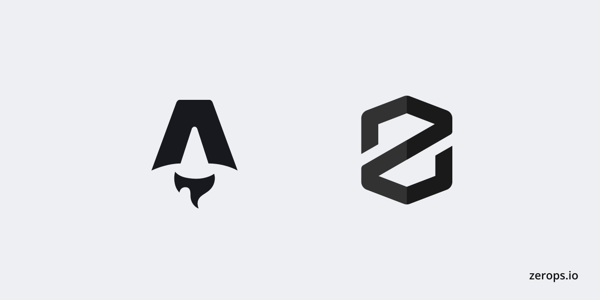

# Zerops x Remix - Nodejs



A Node.js Astro app deployment example for [Zerops](https://zerops.io) - a developer first cloud platform.

## Deploy to Zerops

1. Open [Zerops Dashboard](https://app.zerops.io/dashboard/projects) and locate the **import project** button on the left sidebar
2. Copy & paste the YAML setup below and confirm

```yaml
project:
  name: zerops-astro

services:
  - hostname: astronode
    type: nodejs@20
    buildFromGit: https://github.com/zeropsio/recipe-astro-nodejs
    ports:
      - port: 3000
    enableSubdomainAccess: true
    minContainers: 1
```

Join [Zerops Discord community](https://discord.com/invite/WDvCZ54).
